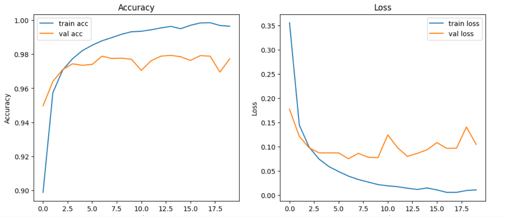
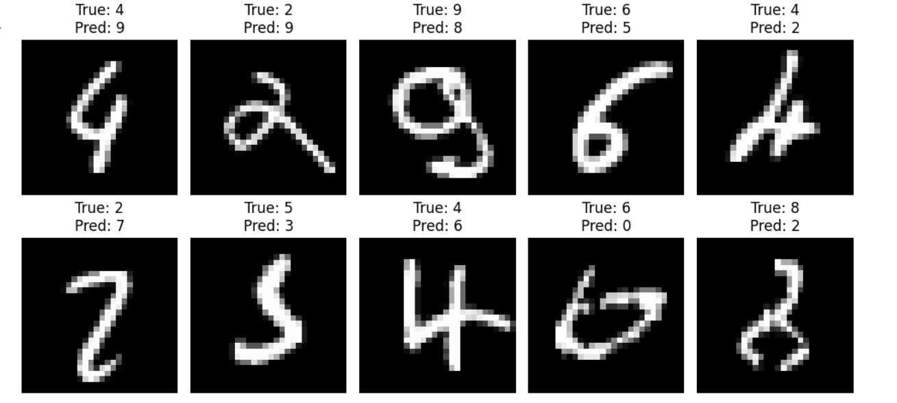

#Project Based Experiments
## Objective :
 Build a Multilayer Perceptron (MLP) to classify handwritten digits in python
## Steps to follow:
## Dataset Acquisition:
Download the MNIST dataset. You can use libraries like TensorFlow or PyTorch to easily access the dataset.
## Data Preprocessing:
Normalize pixel values to the range [0, 1].
Flatten the 28x28 images into 1D arrays (784 elements).
## Data Splitting:

Split the dataset into training, validation, and test sets.
Model Architecture:
## Design an MLP architecture. 
You can start with a simple architecture with one input layer, one or more hidden layers, and an output layer.
Experiment with different activation functions, such as ReLU for hidden layers and softmax for the output layer.
## Compile the Model:
Choose an appropriate loss function (e.g., categorical crossentropy for multiclass classification).Select an optimizer (e.g., Adam).
Choose evaluation metrics (e.g., accuracy).
## Training:
Train the MLP using the training set.Use the validation set to monitor the model's performance and prevent overfitting.Experiment with different hyperparameters, such as the number of hidden layers, the number of neurons in each layer, learning rate, and batch size.
## Evaluation:

Evaluate the model on the test set to get a final measure of its performance.Analyze metrics like accuracy, precision, recall, and confusion matrix.
## Fine-tuning:
If the model is not performing well, experiment with different architectures, regularization techniques, or optimization algorithms to improve performance.
## Visualization:
Visualize the training/validation loss and accuracy over epochs to understand the training process. Visualize some misclassified examples to gain insights into potential improvements.

# Program:
```
import tensorflow as tf
from tensorflow.keras.datasets import mnist
from tensorflow.keras.models import Sequential
from tensorflow.keras.layers import Dense, Flatten
from tensorflow.keras.utils import to_categorical
import matplotlib.pyplot as plt
from sklearn.metrics import classification_report, confusion_matrix
import numpy as np

# 1. Dataset Acquisition
(x_train, y_train), (x_test, y_test) = mnist.load_data()

# 2. Data Preprocessing
x_train = x_train.astype('float32') / 255.0
x_test = x_test.astype('float32') / 255.0

# Flatten images from 28x28 to 784
x_train = x_train.reshape(-1, 28*28)
x_test = x_test.reshape(-1, 28*28)

# Convert labels to one-hot vectors
y_train_cat = to_categorical(y_train, 10)
y_test_cat = to_categorical(y_test, 10)

# 3. Data Splitting (split training into train + validation)
from sklearn.model_selection import train_test_split
x_train, x_val, y_train_cat, y_val_cat = train_test_split(
    x_train, y_train_cat, test_size=0.1, random_state=42
)

# 4. Model Architecture
model = Sequential([
    Dense(128, activation='relu', input_shape=(784,)),
    Dense(64, activation='relu'),
    Dense(10, activation='softmax')
])

# 5. Compile the Model
model.compile(
    loss='categorical_crossentropy',
    optimizer='adam',
    metrics=['accuracy']
)

# 6. Training
history = model.fit(
    x_train, y_train_cat,
    epochs=20,
    batch_size=128,
    validation_data=(x_val, y_val_cat),
    verbose=2
)

# 7. Evaluation
test_loss, test_acc = model.evaluate(x_test, y_test_cat, verbose=0)
print(f"Test accuracy: {test_acc:.4f}")

# Predict labels for confusion matrix
y_pred = model.predict(x_test)
y_pred_classes = np.argmax(y_pred, axis=1)
y_true = np.argmax(y_test_cat, axis=1)

print("\nClassification Report:")
print(classification_report(y_true, y_pred_classes))

print("Confusion Matrix:")
print(confusion_matrix(y_true, y_pred_classes))

# 8. Visualization

# Plot accuracy and loss
plt.figure(figsize=(12, 5))

plt.subplot(1, 2, 1)
plt.plot(history.history['accuracy'], label='train acc')
plt.plot(history.history['val_accuracy'], label='val acc')
plt.title('Accuracy')
plt.xlabel('Epoch')
plt.ylabel('Accuracy')
plt.legend()

plt.subplot(1, 2, 2)
plt.plot(history.history['loss'], label='train loss')
plt.plot(history.history['val_loss'], label='val loss')
plt.title('Loss')
plt.xlabel('Epoch')
plt.ylabel('Loss')
plt.legend()

plt.show()

# Visualize some misclassified examples
misclassified_idx = np.where(y_pred_classes != y_true)[0]
plt.figure(figsize=(10, 5))
for i, idx in enumerate(misclassified_idx[:10]):
    plt.subplot(2, 5, i+1)
    plt.imshow(x_test[idx].reshape(28,28), cmap='gray')
    plt.title(f"True: {y_true[idx]}\nPred: {y_pred_classes[idx]}")
    plt.axis('off')
plt.tight_layout()
plt.show()
```

## Output:





